# 🏦 Mausam's Bank

**Smart Banking. Simple Banking.**

A full-stack digital banking platform built with the MERN stack (MongoDB, Express, React, Node.js). Customers can register, deposit, withdraw, transfer money, and track their transaction history. Admins can monitor the bank, manage customers, and freeze/unfreeze accounts.

---

## Table of Contents

1. [Features](#features)
2. [Tech Stack](#tech-stack)
3. [Folder Structure](#folder-structure)
4. [Prerequisites](#prerequisites)
5. [Installation & Setup](#installation--setup)
6. [Environment Variables](#environment-variables)
7. [Running the Project](#running-the-project)
8. [Demo Credentials](#demo-credentials)
9. [API Documentation](#api-documentation)
10. [Testing the Application](#testing-the-application-checklist)
11. [Troubleshooting](#troubleshooting)
12. [Git Workflow](#git-workflow)
13. [Future Improvements](#future-improvements)
14. [Deployment Guide](#deployment-guide)

---

## Features

### Customer
- Register / Login / Logout with JWT authentication
- Dashboard with balance, account details, and recent activity
- Deposit money with optional notes
- Withdraw money with daily withdrawal limit protection
- Transfer money to any account (with receiver verification before sending)
- Transaction history with search, filter by type, sort, and pagination
- Profile management (edit phone/address) and password change

### Admin
- Separate admin login
- Bank-wide statistics dashboard (customers, deposits, withdrawals, transactions)
- Search and manage all customers
- Freeze / unfreeze / delete customer accounts
- View any customer's full transaction history
- View all transactions across the bank

### Engineering
- JWT authentication + bcrypt password hashing
- Role-based route protection (customer vs admin)
- Server-side input validation (`express-validator`)
- MongoDB transactions for atomic money transfers (sender & receiver update together)
- Auto-generated unique account numbers and transaction IDs
- Centralized error handling middleware
- Fully responsive UI (mobile, tablet, desktop)

---

## Tech Stack

| Layer | Technology |
|---|---|
| Frontend | React (Vite), Tailwind CSS, React Router DOM, Axios, Context API, React Hot Toast, React Icons |
| Backend | Node.js, Express.js |
| Database | MongoDB, Mongoose |
| Auth | JWT, bcryptjs |
| Validation | express-validator |
| Dev Tools | nodemon, dotenv, cors |

---

## Folder Structure

```
mausams-bank/
├── backend/
│   ├── config/
│   │   └── db.js                  # MongoDB connection
│   ├── controllers/
│   │   ├── authController.js      # register, login, getMe
│   │   ├── customerController.js  # deposit, withdraw, transfer, transactions, profile
│   │   └── adminController.js     # dashboard stats, customer management
│   ├── middleware/
│   │   ├── auth.js                 # JWT protect + role authorize
│   │   └── errorHandler.js         # centralized error responses
│   ├── models/
│   │   ├── User.js                 # customer/admin schema
│   │   └── Transaction.js          # transaction schema
│   ├── routes/
│   │   ├── authRoutes.js
│   │   ├── customerRoutes.js
│   │   └── adminRoutes.js
│   ├── utils/
│   │   ├── generateAccountNumber.js
│   │   ├── generateTransactionId.js
│   │   └── generateToken.js
│   ├── seed/
│   │   └── seedData.js             # demo data script
│   ├── .env.example
│   ├── server.js
│   └── package.json
│
├── frontend/
│   ├── src/
│   │   ├── components/             # Navbar, Sidebar, DashboardLayout, Spinner, etc.
│   │   ├── context/
│   │   │   └── AuthContext.jsx     # global auth state
│   │   ├── pages/
│   │   │   ├── Landing.jsx, Login.jsx, Register.jsx
│   │   │   ├── Dashboard.jsx, Deposit.jsx, Withdraw.jsx, Transfer.jsx
│   │   │   ├── Transactions.jsx, Profile.jsx
│   │   │   └── admin/
│   │   │       ├── AdminDashboard.jsx, Customers.jsx
│   │   │       ├── CustomerDetail.jsx, AdminTransactions.jsx
│   │   ├── services/
│   │   │   └── api.js               # Axios instance + interceptors
│   │   ├── utils/
│   │   │   └── format.js            # currency/date formatting helpers
│   │   ├── App.jsx
│   │   ├── main.jsx
│   │   └── index.css
│   ├── index.html
│   ├── tailwind.config.js
│   ├── vite.config.js
│   ├── .env.example
│   └── package.json
│
└── README.md
```

---

## Prerequisites

Install these before you start:

1. **Node.js** v18 or later — [nodejs.org](https://nodejs.org)
2. **MongoDB** — either:
   - Local install ([MongoDB Community Server](https://www.mongodb.com/try/download/community)), or
   - Free cloud cluster via [MongoDB Atlas](https://www.mongodb.com/cloud/atlas)
3. **Git** — [git-scm.com](https://git-scm.com)
4. **VS Code** (recommended) with these extensions:
   - ESLint
   - Tailwind CSS IntelliSense
   - MongoDB for VS Code
   - Thunder Client or Postman (for testing APIs)

> **Note on transfers:** The `transfer` feature uses a MongoDB multi-document transaction (so the sender's and receiver's balances update atomically). This requires MongoDB to run as a **replica set**. A local single-node MongoDB Atlas cluster or a local `mongod --replSet rs0` setup both work. See [Troubleshooting](#troubleshooting) if you hit a transaction error.

---

## Installation & Setup

### 1. Clone / unzip the project
```bash
cd mausams-bank
```

### 2. Backend setup
```bash
cd backend
npm install
cp .env.example .env
```
Now open `.env` and fill in your values (see [Environment Variables](#environment-variables)).

### 3. Frontend setup
```bash
cd ../frontend
npm install
cp .env.example .env
```

---

## Environment Variables

### `backend/.env`
```env
PORT=5000
NODE_ENV=development

MONGO_URI=mongodb://127.0.0.1:27017/mausams_bank

JWT_SECRET=change_this_to_a_long_random_secret_string
JWT_EXPIRES_IN=7d

CLIENT_URL=http://localhost:5173

DAILY_WITHDRAWAL_LIMIT=50000
```

If using MongoDB Atlas, `MONGO_URI` will look like:
```
mongodb+srv://<username>:<password>@cluster0.xxxxx.mongodb.net/mausams_bank
```

### `frontend/.env`
```env
VITE_API_URL=http://localhost:5000/api
```

---

## Running the Project

### Step 1 — Start MongoDB
- **Local:** run `mongod` in a terminal (or start the MongoDB service).
- **Atlas:** nothing to start locally — just make sure your IP is whitelisted and the connection string in `.env` is correct.

### Step 2 — Seed demo data (recommended)
```bash
cd backend
npm run seed
```
This creates one admin account and three demo customers (one frozen) with sample transactions, and prints the login credentials to the console.

### Step 3 — Start the backend
```bash
cd backend
npm run dev
```
You should see:
```
✅ MongoDB Connected: ...
🚀 Server running in development mode on port 5000
```

### Step 4 — Start the frontend
Open a **new terminal**:
```bash
cd frontend
npm run dev
```
Visit **http://localhost:5173**

---

## Demo Credentials

| Role | Email | Password | Notes |
|---|---|---|---|
| Admin | admin@mausamsbank.com | Admin@123 | Full admin access |
| Customer | customer@mausamsbank.com | Customer@123 | Active account, ₹25,000 balance |
| Customer | ritika@mausamsbank.com | Customer@123 | Active account, ₹12,500 balance |
| Customer | suman@mausamsbank.com | Customer@123 | **Frozen** account (for testing) |

Admin login page: `http://localhost:5173/admin/login`
Customer login page: `http://localhost:5173/login`

---

## API Documentation

Base URL: `http://localhost:5000/api`

All protected routes require a header: `Authorization: Bearer <token>`

### Auth Routes (`/auth`)

| Method | Endpoint | Access | Body | Description |
|---|---|---|---|---|
| POST | `/auth/register` | Public | `{ name, email, password, phone, address?, accountType? }` | Register a new customer, returns token + user |
| POST | `/auth/login` | Public | `{ email, password }` | Login (customer or admin), returns token + user |
| GET | `/auth/me` | Private | — | Get currently logged-in user's profile |

### Customer Routes (`/customer`) — role: customer

| Method | Endpoint | Body / Query | Description |
|---|---|---|---|
| GET | `/customer/dashboard` | — | Balance, account info, 5 recent transactions |
| POST | `/customer/deposit` | `{ amount, note? }` | Deposit funds |
| POST | `/customer/withdraw` | `{ amount, note? }` | Withdraw funds (checks balance + daily limit) |
| GET | `/customer/verify-account/:accountNumber` | — | Verify a receiver account exists before transferring |
| POST | `/customer/transfer` | `{ receiverAccountNumber, amount, note? }` | Transfer to another account |
| GET | `/customer/transactions` | `?search=&type=&sort=&page=&limit=` | Paginated transaction history |
| PUT | `/customer/profile` | `{ phone?, address? }` | Update profile |
| PUT | `/customer/change-password` | `{ currentPassword, newPassword }` | Change password |

### Admin Routes (`/admin`) — role: admin

| Method | Endpoint | Query | Description |
|---|---|---|---|
| GET | `/admin/dashboard` | — | Bank-wide stats + recent customers/transactions |
| GET | `/admin/customers` | `?search=&status=&page=&limit=` | List/search customers |
| GET | `/admin/customers/:id` | — | Single customer + their transactions |
| PUT | `/admin/customers/:id/freeze` | — | Freeze an account |
| PUT | `/admin/customers/:id/unfreeze` | — | Unfreeze an account |
| DELETE | `/admin/customers/:id` | — | Delete an account and its transactions |
| GET | `/admin/transactions` | `?search=&type=&page=&limit=` | All transactions bank-wide |

**Standard response shape:**
```json
{ "success": true, "message": "...", "data...": "..." }
```
**Error shape:**
```json
{ "success": false, "message": "Human-readable error" }
```
**Status codes used:** `200` OK · `201` Created · `400` Validation/business error · `401` Unauthorized · `403` Forbidden (frozen/wrong role) · `404` Not found · `500` Server error

---

## Testing the Application (Checklist)

1. ☐ Register a new customer → note the generated account number
2. ☐ Log out, log back in with the new account
3. ☐ Deposit money → confirm balance updates on dashboard
4. ☐ Withdraw money → try exceeding balance (should fail) and exceeding daily limit (should fail)
5. ☐ Transfer money to the seeded `ritika@mausamsbank.com` account number → verify both sender and receiver balances update
6. ☐ Try transferring to a frozen account (`suman@mausamsbank.com`'s account number) → should be blocked
7. ☐ Open Transaction History → test search, type filter, sort, and pagination
8. ☐ Edit profile phone/address → confirm it saves
9. ☐ Change password → log out → log back in with new password
10. ☐ Log in as admin → check dashboard stats match seeded data
11. ☐ Search for a customer, view their detail page, freeze their account
12. ☐ Log in as that frozen customer → should be blocked with a clear message
13. ☐ Unfreeze the account from admin panel → customer can log in again
14. ☐ Delete a test customer account → confirm it disappears from the list
15. ☐ Resize the browser / open on mobile → confirm layout adapts (sidebar collapses to a menu)

---

## Troubleshooting

**"MongoDB Connection Error"**
- *Why:* `MONGO_URI` is wrong, or MongoDB isn't running.
- *Fix:* Confirm `mongod` is running locally, or that your Atlas connection string, username/password, and IP whitelist are correct.

**"This MongoDB instance does not support multi-document transactions"** (only on `/transfer`)
- *Why:* Money transfers use a MongoDB session transaction, which requires a replica set. A default standalone `mongod` doesn't have one.
- *Fix (local):* Initialize a single-node replica set:
  ```bash
  mongod --replSet rs0 --dbpath /path/to/your/data
  # in a separate mongo shell:
  mongosh --eval "rs.initiate()"
  ```
  Then update `MONGO_URI` to `mongodb://127.0.0.1:27017/mausams_bank?replicaSet=rs0`.
- *Fix (easiest):* Use a free MongoDB Atlas cluster — Atlas clusters are replica sets by default, so transactions work out of the box.

**CORS errors in the browser console**
- *Why:* `CLIENT_URL` in `backend/.env` doesn't match where the frontend is actually running.
- *Fix:* Set `CLIENT_URL=http://localhost:5173` (or your actual frontend URL) and restart the backend.

**"Not authorized, token invalid or expired"**
- *Why:* The JWT expired, `JWT_SECRET` changed, or `localStorage` has a stale token.
- *Fix:* Log out and log back in. If you changed `JWT_SECRET`, all existing tokens become invalid — this is expected.

**Frontend shows a blank page / network errors**
- *Why:* Backend isn't running, or `VITE_API_URL` points to the wrong port.
- *Fix:* Confirm the backend terminal shows "Server running..." and that `frontend/.env` matches its port.

**"Port already in use" (5000 or 5173)**
- *Fix:* Stop the other process using that port, or change `PORT` in `backend/.env` (and `VITE_API_URL` accordingly), or add `server: { port: X }` in `vite.config.js`.

**`npm install` fails**
- *Fix:* Delete `node_modules` and `package-lock.json`, then retry. Confirm your Node.js version is 18+.

---

## Git Workflow

The project already includes `.gitignore` files for both `backend/` and `frontend/` that exclude `node_modules/`, `.env`, and build output.

### Initializing the repo
```bash
cd mausams-bank
git init
git add .
git commit -m "chore: initial commit - Mausam's Bank MERN banking app"
```

### Recommended commit message style (Conventional Commits)
```
feat: add transfer money flow with account verification
fix: prevent negative balance on withdrawal
refactor: extract account number generator into utils
docs: add API documentation to README
style: adjust dashboard card spacing
chore: add .env.example files
```

### Pushing to GitHub
```bash
git branch -M main
git remote add origin https://github.com/<your-username>/mausams-bank.git
git push -u origin main
```

**Never commit your `.env` files** — they contain secrets. Only commit `.env.example`.

---

## Future Improvements

- Email/SMS OTP verification on registration and large transactions
- Downloadable PDF account statements
- Recurring/scheduled transfers and standing instructions
- Fixed deposit and loan modules
- Two-factor authentication for admin accounts
- Rate limiting and audit logging on sensitive endpoints
- Dark mode

---

## Deployment Guide

**Backend** (e.g. Render, Railway, or a VPS):
1. Push the `backend/` folder to a Git repo.
2. Create a new Web Service pointing at it, with build command `npm install` and start command `npm start`.
3. Add all variables from `.env.example` to the platform's environment variable settings — use a MongoDB Atlas URI for `MONGO_URI`.
4. Set `CLIENT_URL` to your deployed frontend's URL.

**Frontend** (e.g. Vercel or Netlify):
1. Push the `frontend/` folder to a Git repo.
2. Import it into Vercel/Netlify, framework preset: Vite.
3. Set the environment variable `VITE_API_URL` to your deployed backend's `/api` URL.
4. Deploy.

**Database:** Use MongoDB Atlas (free tier is sufficient for a project) — it's a replica set by default, so the transfer feature's transactions work without extra configuration.

---

<h2 align="center">📸 Project Screenshots</h2>

<p align="center">
  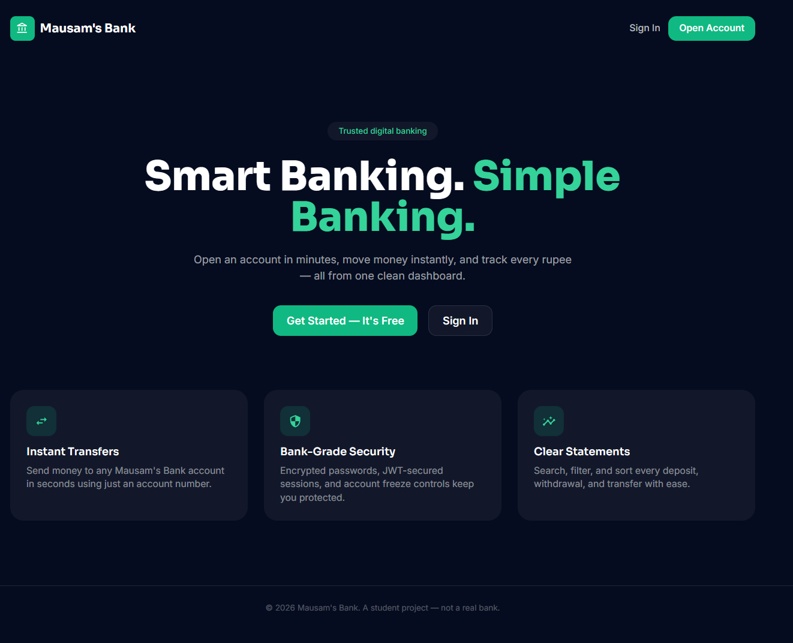
  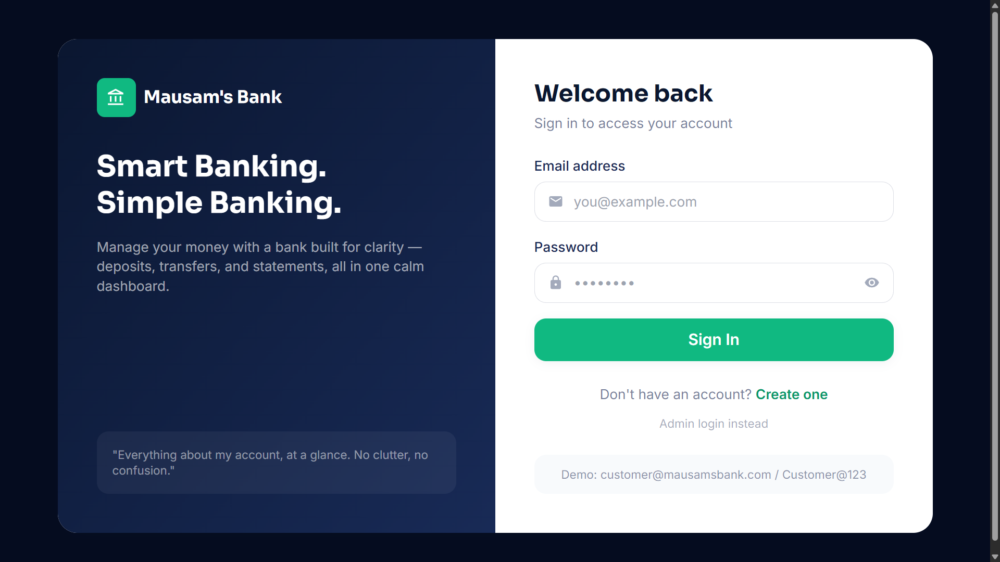
</p>

<p align="center">
  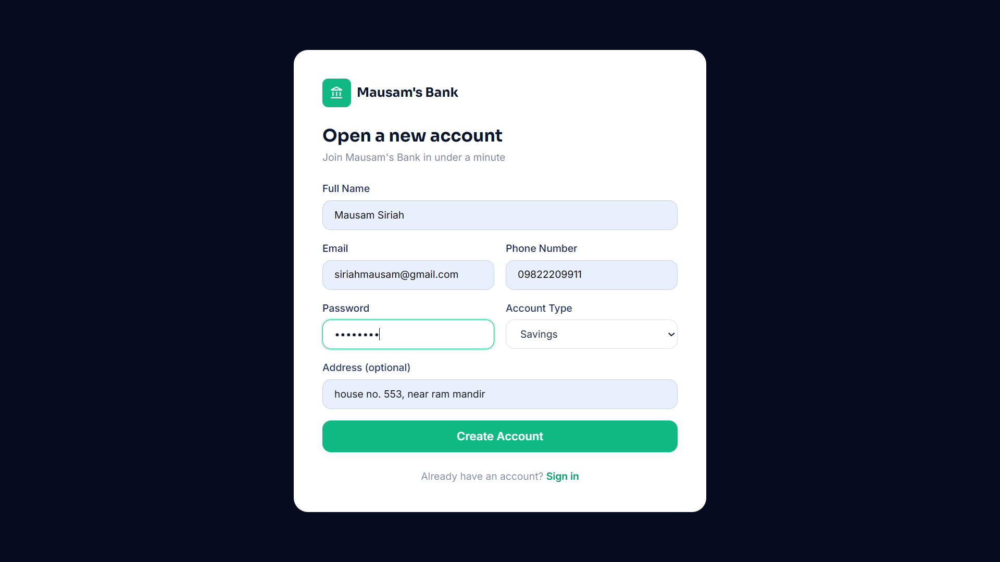
  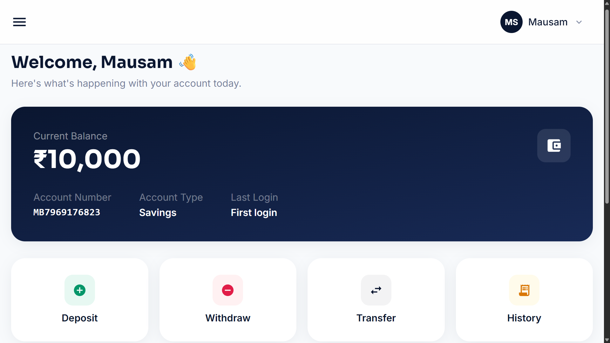
</p>

<p align="center">
  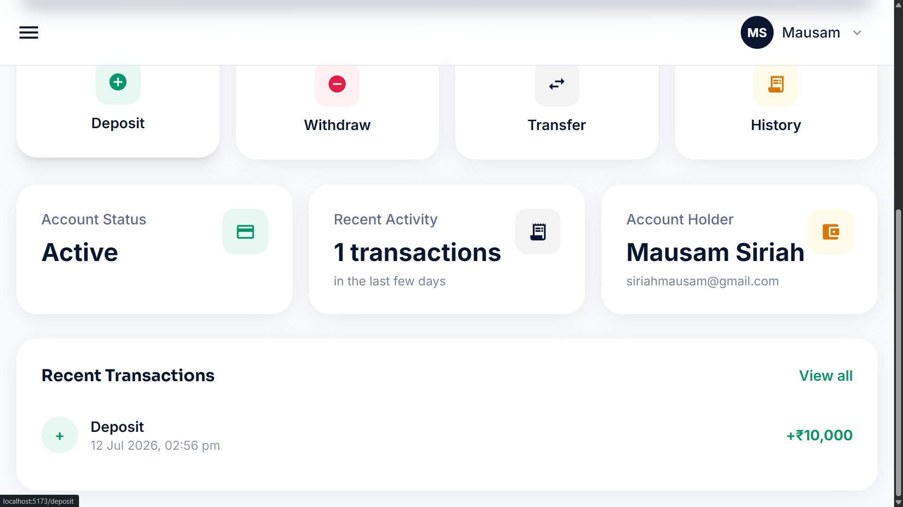
  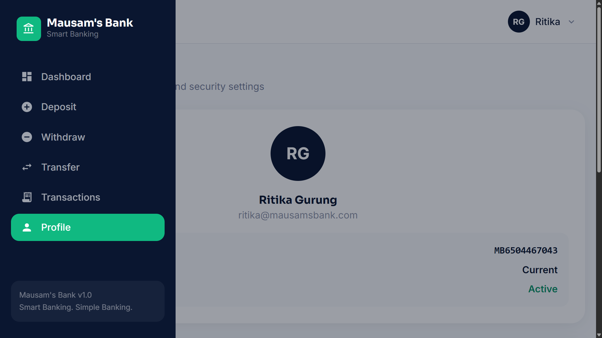
</p>

<p align="center">
  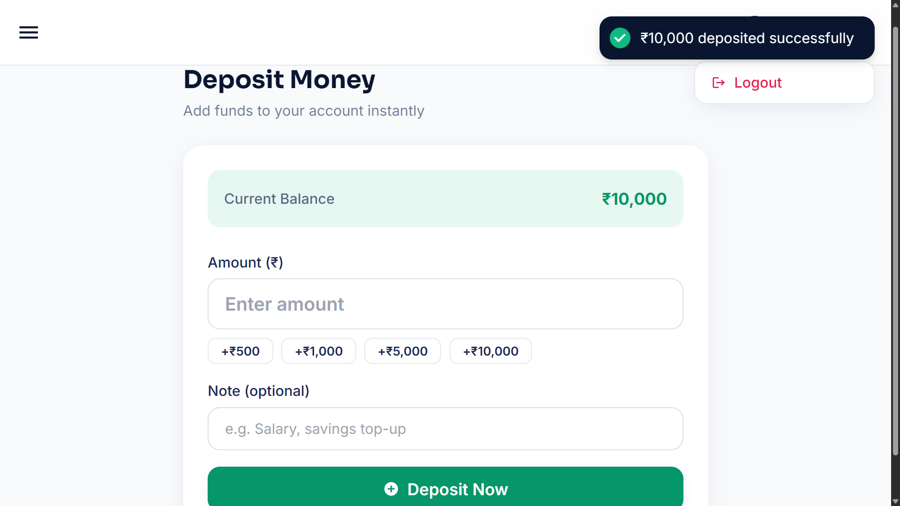
  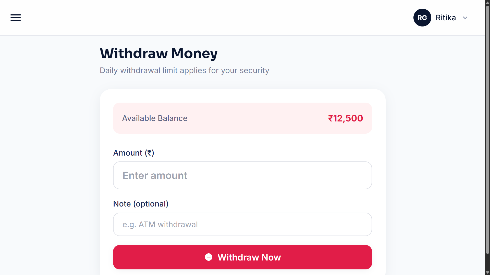
</p>

<p align="center">
  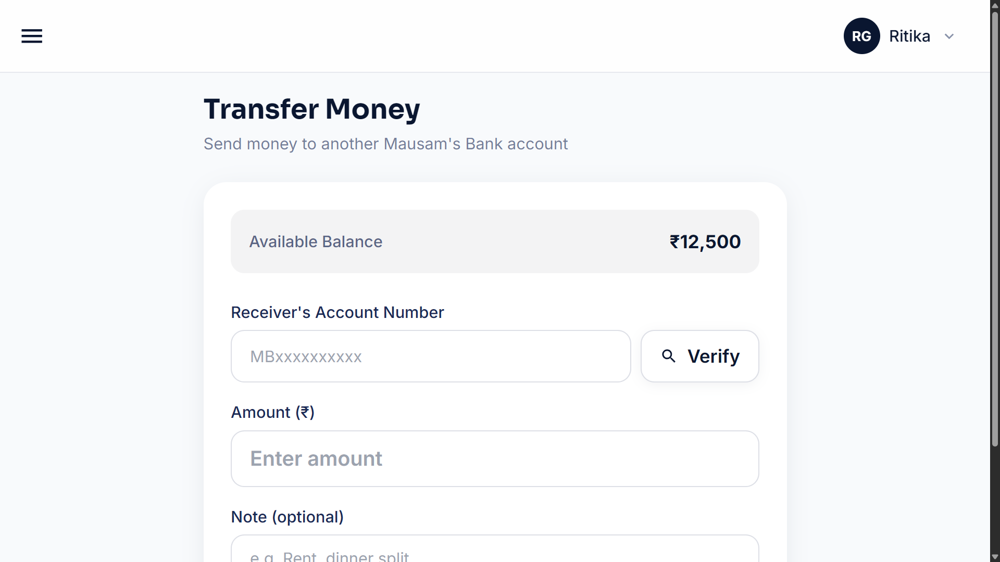
  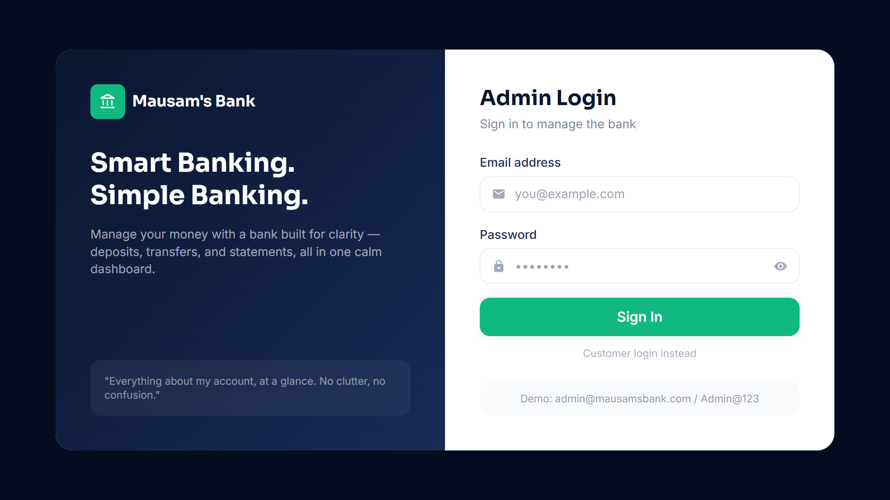
</p>

<p align="center">
  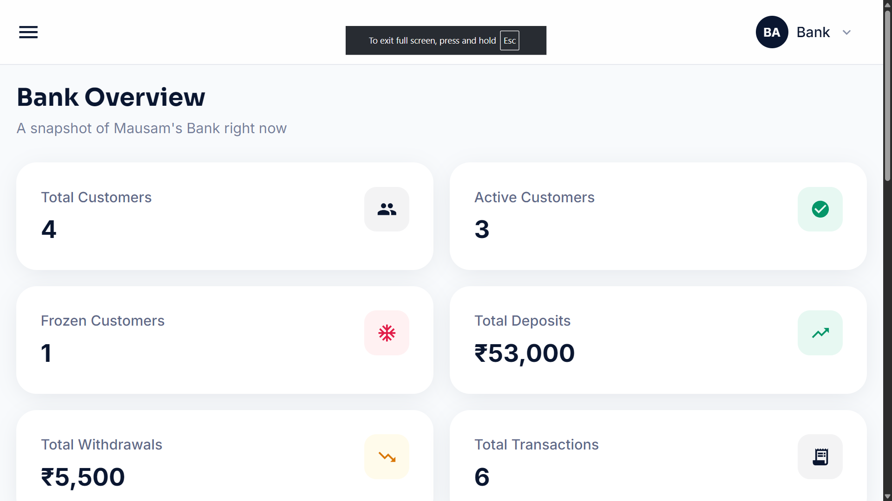
  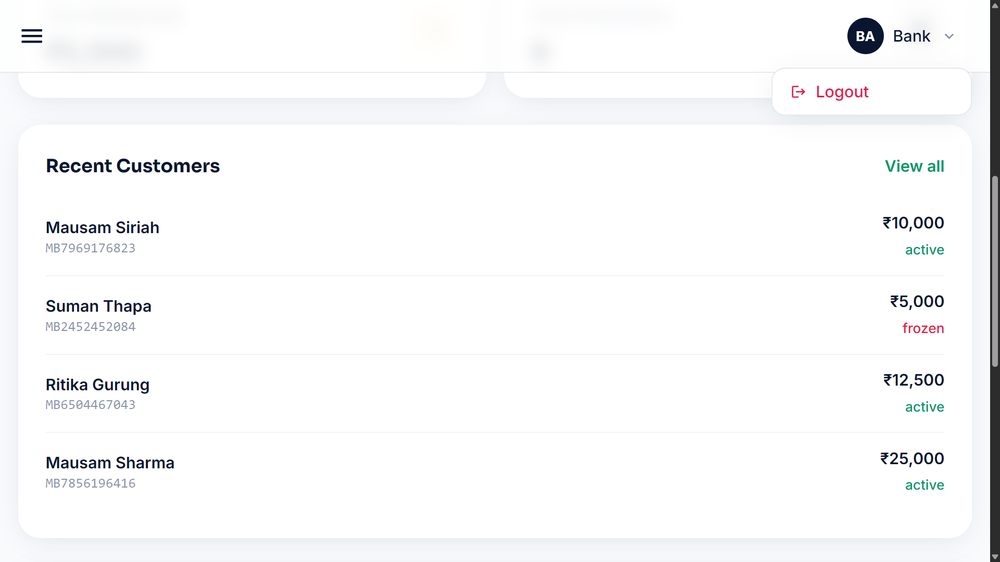
</p>

<p align="center">
  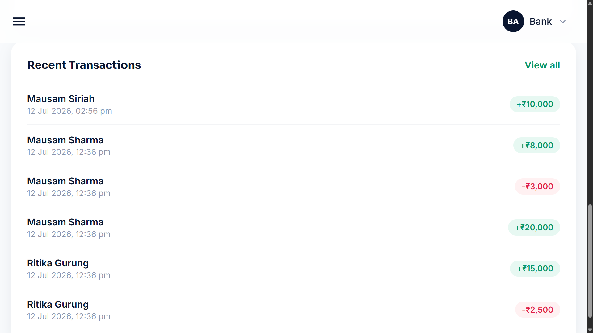
  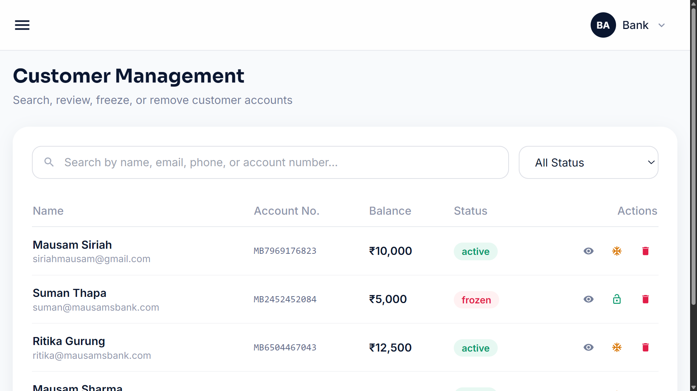
</p>

<p align="center">
  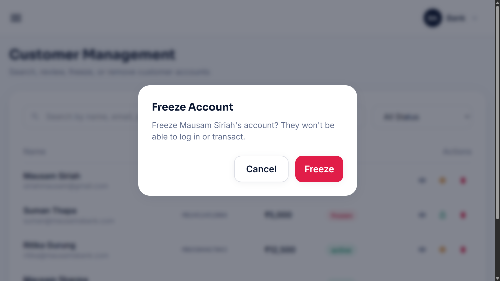
  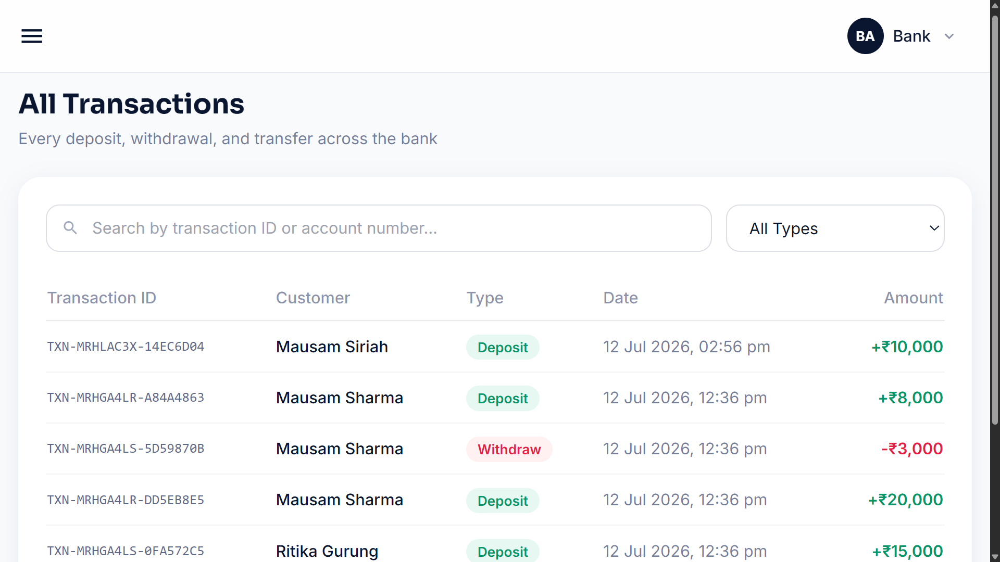
</p>
---

Built as a MERN stack learning project. Not a real bank — please don't deposit real money. 🙂
